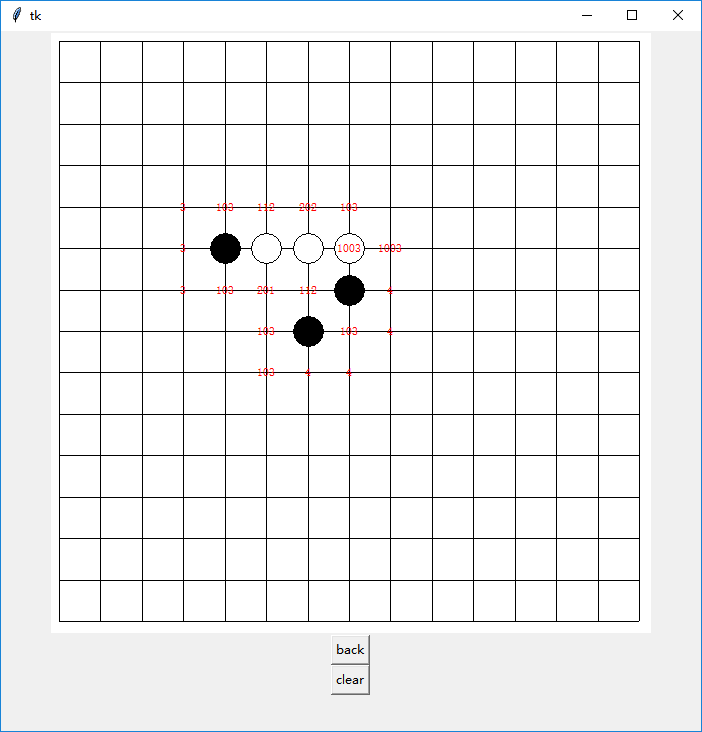

# gobang
I am interested in gobang,so I am going to use python to draw GUI and program a powerful AI to have fun!

I will implement my idea by alpha-beta algorithm and alphago-zero algorithm. 

Welcome to contribute code and correct the error about my English programmer.



## gobang plan
* First,I build a UI and rule about gobang to prepare to develop the AI in next step.
* Second,write a evaluate function and a function to found out valuable points to calculate next.
* Third,I will use the traditional way using alpha-beta algorithm to design a easy AI.
* Ultimately,I am going to use the way like alphago.
Now,I have finish the step 2.

## how to run
there are three python files to run.
1. main_base.py
3. main_AI.py
3. main_AI_competition.py

* __assuming you want to play with the simple AI on the offensive(or not),you can:__

windows:
```
py -3 main_AI.py --you true(or false)
```
linux:
```
python3 main_AI.py --you true(or false)
```
note:this AI you play with is a simple AI for gobang 
who only can consider chess board in one step.

* __assuming you want to watch the stupid competition among AIs,you can:__

windows:
```
py -3 main_AI_competition.py
```
linux:
```
python3 main_AI_competition.py
```
the result may be this:
```
 |           1                   | 
 |         2   1                 | 
 |   1 2 2 2 2 1 2 1   2         | 
 | 1   2   2   1 2 2 1           | 
 |   2 1 1 1 1 2   1 2 2         | 
 | 2 1 2   2 2 1 1 1 2 1         | 
 |       2 1 1 2 2 1 2 1 2 1     | 
 |       1 2 2 1 1 1 2 1 1 2     | 
 |         2 1 1 2 2 1 2 2 2 1 2 | 
 |   2   1 2 1 1 2 2 2 1 2 2 1   | 
 |   1 1 2 2 1 2 1 1 2 1 2 2 2 1 | 
 |     2 1 1 1 1 2 2 1 1 2 1 1 1 | 
 |   1   2 1 2 2 2 1 1 2 2 2 1 2 | 
 |         1 2 2 1   1 2 1       | 
 |         1 1 2     1           | 
```
Wow!Interesting.

## code style
I use PEP8 style guide for my python code.

## project structure
This is the project structure edited by 'Astah'

